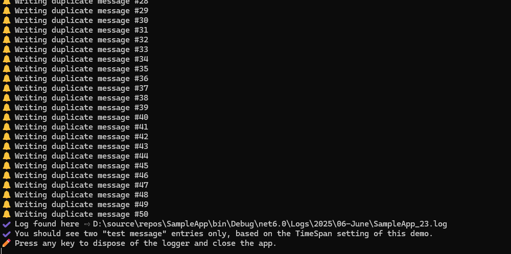

## 💻 Smart Logger


## 📝 v1.0.0.1 - June 2025

**Dependencies**

| Assembly | Version |
| ---- | ---- |
| .NET Core | 6.0 |
| .NET Framework | 4.8 |

## 📰 Description
- A duplicate-aware logging library for reducing unnecessary log entries.
- This library offers synchronous and asynchronous write methods.
- This project includes compilation outputs for both **.NET Framework 4.8** and **.NET Core 6.0**

## 🎛️ Library Definitions

```csharp
   /// <summary>
   /// Occurs when a write operation fails.
   /// </summary>
   /// <remarks>This event is triggered when an exception is encountered during a write operation.</remarks>
   event Action<string, Exception>? WriteFailure;

   /// <summary>
   /// Synchronously writes a log entry to the log file.
   /// </summary>
   /// <param name="message">the string to log</param>
   /// <param name="level">the indicated <see cref="LogLevel"/></param>
   /// <remarks>If <see cref="LogLevel.None"/> then file write is skipped and output will be to console only.</remarks>
   void Write(string message, LogLevel level = LogLevel.Info);

   /// <summary>
   /// Asynchronously writes a log entry to the log file.
   /// </summary>
   /// <param name="message">the string to log</param>
   /// <param name="level">the indicated <see cref="LogLevel"/></param>
   /// <remarks>If <see cref="LogLevel.None"/> then file write is skipped and output will be to console only.</remarks>
   Task WriteAsync(string message, LogLevel level = LogLevel.Info);

   /// <summary>
   /// Deferred file writing on another thread - this method will wait for the file to become available before writing.
   /// </summary>
   /// <param name="message">the string to log</param>
   /// <param name="level">the indicated <see cref="LogLevel"/></param>
   /// <param name="retries">the number of times to try and write, if the file is locked</param>
   /// <remarks>The order of writes is not guaranteed, as this is threaded and may experience other re-entry operations.</remarks>
   void WriteDeferred(string message, LogLevel level = LogLevel.Info, int retries = 100);

   /// <summary>
   /// Returns the current logging path.
   /// </summary>
   string GetLogPath();

   /// <summary>
   /// Returns the full log file path with file name.
   /// </summary>
   string GetLogName();

   /// <summary>
   /// Clears the log history, removing all stored log entries.
   /// </summary>
   void ClearHistory();

   /// <summary>
   /// Clears any queue items and calls the GC.
   /// </summary>
   void Dispose();
```

```csharp

    /** Samples **/

    Console.WriteLine("✔️ Creating SmartLogger (with memory of 10 seconds) …");

    // Configure the logger with no file name, allowing it to generate a path and name based on the current date/time.
    ISmartLogger? _logger = new SmartLogger("", "hh:mm:ss.fff tt", 10, TimeSpan.FromSeconds(10));

    #region [Event Handler]
    _logger.WriteFailure += (msg, ex) =>
    {
        Console.WriteLine($"🚨 Failed during write '{msg}'");
        Console.WriteLine($"🚨 Exception message: {ex.Message}");
    };
    #endregion

    #region [Asynchronous Write Test]
    _logger.Write($"Starting duplicate write test…");
    for (int i = 1; i < 51; i++)
    {
        await Task.Delay(250); // Simulate some delay
        Console.WriteLine($"🔔 Writing duplicate message #{i}");
        await _logger.WriteAsync($"This is a test message for duplicate checking.");
    }
    #endregion

    #region [Deferred Write Test]
    _logger.WriteDeferred($"Starting deferred write test…");
    for (int i = 1; i < 51; i++)
    {
        Thread.Sleep(250); // Simulate some delay
        Console.WriteLine($"🔔 Writing deferred message #{i}");
        _logger.WriteDeferred($"This is a test message for deferred writing.");
    }
    #endregion

    _logger.Write($"Logging tests completed.");

    Console.WriteLine($"✔️ Log found here ⇨ {_logger.GetLogName()}");

    _logger?.Dispose();

```

## 🎛️ Running SampleApp

- `C:\> SampleApp`

- `PS> .\SampleApp`

## 📷 Screenshot



## 🧾 License/Warranty
* Permission is hereby granted, free of charge, to any person obtaining a copy of this software and associated documentation files (the "Software"), to deal in the Software without restriction, including without limitation the rights to use, copy, modify, merge, publish and distribute copies of the Software, and to permit persons to whom the Software is furnished to do so, subject to the following conditions: The above copyright notice and this permission notice shall be included in all copies or substantial portions of the Software.
* The software is provided "as is", without warranty of any kind, express or implied, including but not limited to the warranties of merchantability, fitness for a particular purpose and noninfringement. In no event shall the author or copyright holder be liable for any claim, damages or other liability, whether in an action of contract, tort or otherwise, arising from, out of or in connection with the software or the use or other dealings in the software.
* Copyright © 2025. All rights reserved.

## 📋 Proofing
* This application was compiled and tested using *VisualStudio* 2022 on *Windows 10/11* versions **22H2**, **21H2**, **21H1**, and **23H2**.

